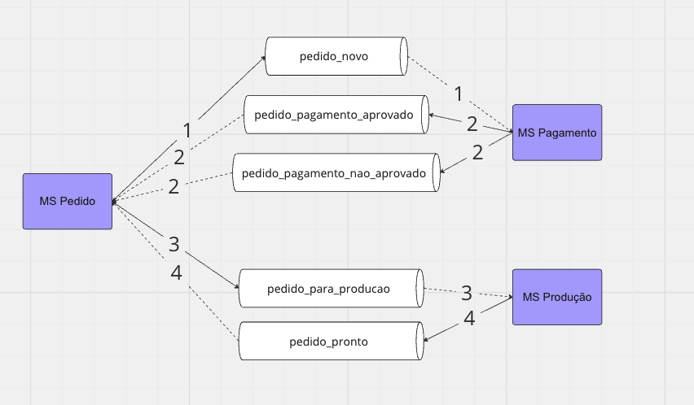

# Guia de Uso do Ambiente

## Subir Ambiente

O primeiro passo para rodar o ambiente local é fazer o clone dos projetos, sendo eles:
- [MS de Pedidos](https://github.com/humbertogalletto/fiap-soat2-33-fase4-pedidos)
- [MS de Pagamento](https://github.com/gabmaxs/fiap-microservice-pagamento)
- [MS de Producao](https://github.com/DaniloParkour/tech_lances_servico_controle_de_pedidos)

Após isso é preciso criar as imagens docker local, para cada ambiente segue o comando:
- MS de pedidos: `docker build -t tech-challenge/order-api .`
- MS de pagamento: `docker build -t tech-challenge/payment-api .`
- MS de producao: `docker build -t tech-challenge/production-api .`

E por fim, para subir o ambiente deve executar o comando `make start-kubernetes`

As APIs vão estar nos seguintes link:
- MS de Pedidos: http://localhost:8080
- MS de Pagamento: http://localhost:3000
- MS de Producao: http://localhost:8081

## Remover Ambiente

Para remover o ambiente, execute o comando `make delete-namespace`

## Padrão SAGA

A escolha do Padrão SAGA foi do tipo Coreografia. O motivo de usar esse padrão se dá pela vantagem da simplicidade de implementação, onde cada microserviço é responsável por implementar sua comunicação com as filas. A nossa implementação conta com 4 tópicos e a tecnologia utilizada foi o apache Kafka. Cada microserviço envia para a fila em questão quando algum evento (do usuário ou não) é disparado. A imagem a seguir apresenta como foi feita a implementação

